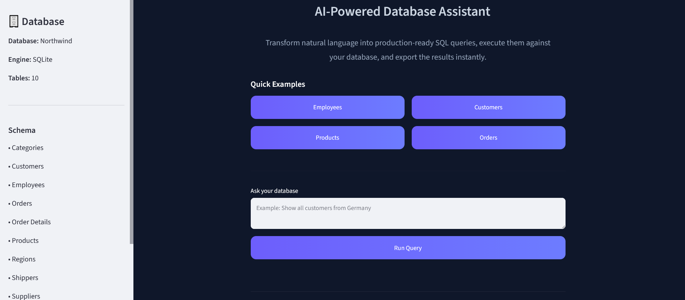
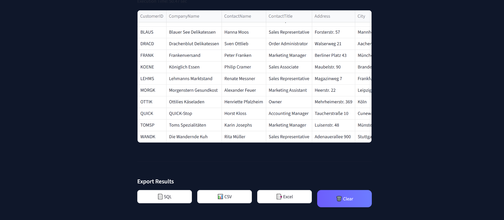

# SQLMind AI


<p align="center">
<b>AI-Powered Text-to-SQL Assistant using a Fine-Tuned Qwen2.5 Model</b>
</p>

---

# 📖 Overview

SQLMind AI is an AI-powered Text-to-SQL application that converts natural language into executable SQL queries using a fine-tuned Qwen2.5 language model.

The generated SQL is automatically executed on a SQLite database through an interactive Streamlit interface, allowing users to view, export, and manage query results instantly.

The model was fine-tuned using QLoRA for efficient inference while maintaining high SQL generation quality.

---

#  Features

| Feature | Description |
|----------|-------------|
| Natural Language → SQL | Convert English requests into SQL queries |
| Fine-Tuned Qwen2.5 | QLoRA fine-tuned language model |
| Execute SQL | Execute generated SQL on SQLite |
| Query Results | Display query results instantly |
| Export Results | Download SQL, CSV, and Excel |
| Query History | Save recently executed queries |
| Modern UI | Interactive Streamlit interface |
| Efficient Inference | 4-bit quantized model |

---

#  Project Architecture

```text
                User
                  │
                  ▼
        Streamlit Web Interface
                  │
                  ▼
      Fine-Tuned Qwen2.5 Model
                  │
                  ▼
        Generated SQL Query
                  │
                  ▼
     SQLite (Northwind Database)
                  │
                  ▼
      Query Results & Export
```

---

#  Project Structure

```text
SQLMind-AI/
│
├── app/
│   ├── app.py
│   ├── inference.py
│   └── database.py
│
├── database/
│   └── northwind2000.sqlite
│
├── training/
│   ├── prepare_dataset.py
│   ├── tokenize_dataset.py
│   └── train.py
│
├── configs/
│   └── training_config.py
│
├── requirements.txt
├── README.md
└── .gitignore
```

---

#  Tech Stack

- Python
- PyTorch
- Hugging Face Transformers
- PEFT (QLoRA)
- BitsAndBytes
- Streamlit
- SQLite
- Pandas
- OpenPyXL
- Datasets
- Accelerate

---

#  Requirements

- Python 3.10+
- CUDA-enabled GPU (recommended)
- pip

Install all dependencies:

```bash
pip install -r requirements.txt
```

---

#  Installation

Clone the repository:

```bash
git clone https://github.com/Sana1020/SQLMind-AI.git
```

Navigate to the project:

```bash
cd SQLMind-AI
```

Create a virtual environment:

```bash
python -m venv .venv
```

### Windows

```powershell
.venv\Scripts\Activate.ps1
```

### Linux / macOS

```bash
source .venv/bin/activate
```

Install dependencies:

```bash
pip install -r requirements.txt
```

---

# ▶️ Running the Application

Launch the Streamlit application:

```bash
streamlit run app/app.py
```

Then open your browser and start interacting with your database using natural language.
---

#  Training Workflow

### 1. Prepare the Dataset

```bash
python training/prepare_dataset.py
```

### 2. Tokenize the Dataset

```bash
python training/tokenize_dataset.py
```

### 3. Fine-Tune the Model

```bash
python training/train.py
```

Training parameters are configured in:

```text
configs/training_config.py
```

The model is fine-tuned using **QLoRA** with **4-bit quantization**, enabling efficient memory usage while preserving strong SQL generation performance.

---

#  Example

### User Input

```text
Show all customers from Germany.
```

### Generated SQL

```sql
SELECT *
FROM Customers
WHERE Country = 'Germany';
```

### Query Result

| CustomerID | CompanyName | Country |
|------------|-------------|----------|
| ALFKI | Alfreds Futterkiste | Germany |
| BLAUS | Blauer See Delikatessen | Germany |

---

#  Example Prompts

- List all employees
- Show all products
- Show all customers from Germany
- List all orders
- Show all suppliers
- List all categories

---

# 📤 Export Options

SQLMind AI allows users to export generated results in multiple formats:

- SQL (.sql)
- CSV (.csv)
- Excel (.xlsx)

This makes it easy to reuse generated queries or analyze the returned data using external tools.

---

#  Query History

The application stores recently executed queries during the current session, allowing users to quickly review previously generated SQL statements.

---

#  Future Improvements

- Automatic Database Schema Detection
- Support for PostgreSQL and MySQL
- SQL Query Explanation
- Query Optimization Suggestions
- Interactive Charts & Dashboards
- REST API
- Docker Deployment
- Authentication & User Management
- Multi-Database Support

---

#  Project Screenshots

### Home Page



### Generated SQL


### Query Results



---

# 👩‍💻 Author

**Sana Elbakry**

Faculty of Computers and Artificial Intelligence

Artificial Intelligence Student

GitHub: https://github.com/Sana1020

---

#  Acknowledgments

This project was built using:

- Hugging Face Transformers
- PEFT (QLoRA)
- PyTorch
- Streamlit
- SQLite
- Northwind Sample Database

---

## License

This project is licensed under the **MIT License**.
